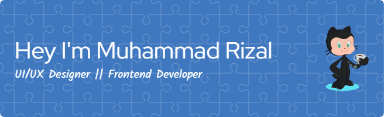

<h1 align="center">Hi there! 👋, I'm Muhammad Rizal</h1>

  

  🌐 Frontend Developer | 🎨 UI/UX Designer | 🚀 Aspiring Fullstack Developer  

  
  
  

---

### 👨‍💻 Tentang Saya

Saya adalah mahasiswa **Teknik Informatika** di  
**Sekolah Tinggi Teknologi Informatika Sony Sugema**.

Saya memiliki minat besar di bidang **Frontend Development** dan **UI/UX Design**.  
Saya percaya bahwa antarmuka yang baik adalah kunci dari pengalaman pengguna yang luar biasa.

🎯 **Cita-cita saya adalah menjadi seorang Fullstack Developer** yang mampu membangun aplikasi dari frontend hingga backend.

---

### 🛠️ Teknologi & Tools yang Saya Gunakan

---

### 📈 GitHub Stats

  
  

---

### 📫 Hubungi Saya

- ✉️ Email: rizal180204@gmail.com  
- 💼 LinkedIn: [Muhammad Rizal](https://www.linkedin.com/in/muhammad-rizal-0742ba179?utm_source=share&utm_campaign=share_via&utm_content=profile&utm_medium=android_app)

---

> *“Belajar bukan tentang siapa yang tercepat, tapi siapa yang tidak berhenti.”* 💪

<picture>
  <source media="(prefers-color-scheme: dark)" srcset="https://raw.githubusercontent.com/Mohzhal/Mohzhal/output/pacman-contribution-graph-dark.svg">
  <source media="(prefers-color-scheme: light)" srcset="https://raw.githubusercontent.com/Mohzhal/Mohzhal/output/pacman-contribution-graph.svg">
  
</picture>

###

###
